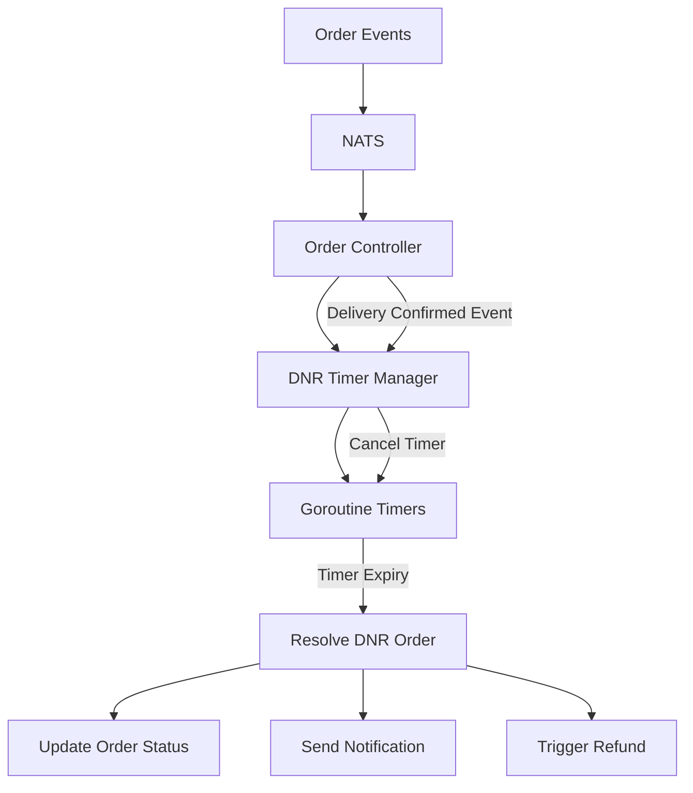
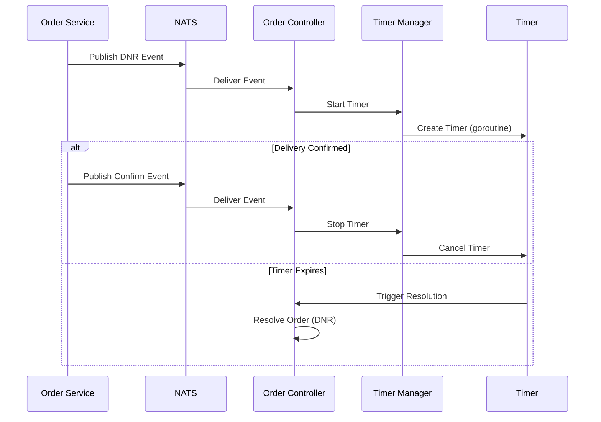
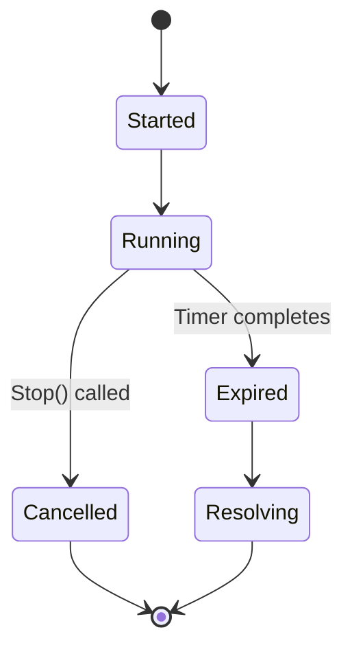
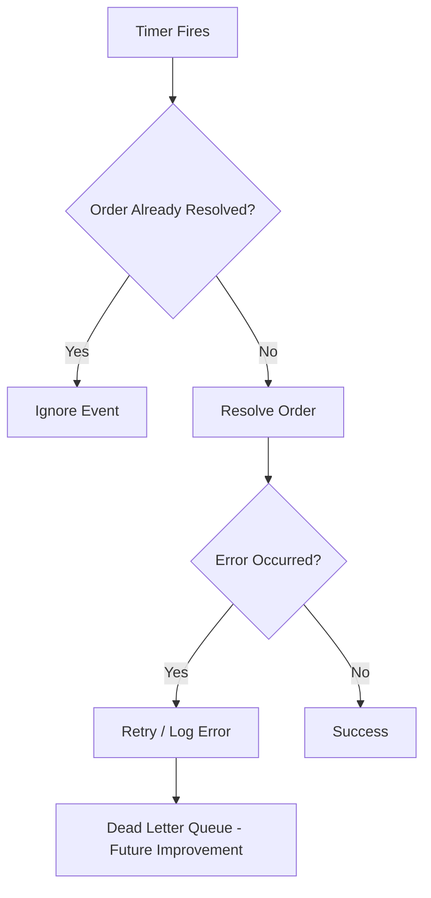
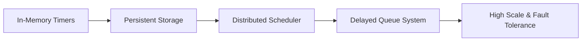

# 🧩 Event-Driven DNR Timer System

> An event-driven system for handling delayed “Delivery Not Received” resolution using Go, NATS, and concurrency patterns.

---

## 📌 Overview

The DNR Timer System is an event-driven backend component designed to handle delayed order resolution workflows. It listens to order events and triggers time-based actions when a delivery is not confirmed within a defined window.

This system ensures automated handling of “Delivery Not Received” scenarios, improving operational efficiency and reducing manual intervention.

---

## 🧠 Problem Statement

Design a system that automatically detects and resolves “Delivery Not Received” scenarios using time-based workflows, while handling asynchronous events reliably.

---

## ⚙️ Key Features

* ⏱️ Per-order asynchronous timers using goroutines
* 🔁 Event-driven architecture using NATS
* 🛑 Safe timer cancellation on delivery confirmation
* 📦 Automated resolution of DNR orders after timeout
* 🔐 Thread-safe timer management using mutexes
* 📡 Structured logging for observability and debugging

---

## 🏗️ Architecture

---

## 🔁 Event Flow

### 1. Delivery Not Received Event

* Order event received via NATS
* Timer started for the order

### 2. Delivery Confirmed Event

* Timer cancelled to prevent unnecessary processing

### 3. Timer Expiry

* Order automatically resolved as DNR
* Downstream actions triggered (status update, notifications, refunds)

---

## ⏱️ Timer Design

Each order is assigned a dedicated timer managed by a centralized timer manager.

* Uses `context.WithCancel` for safe cancellation
* Uses `sync.Mutex` for thread-safe state management
* Uses `time.NewTimer` for execution trigger
* Uses `time.NewTicker` for periodic progress logging

---

## 🧠 Design Considerations

### Concurrency

* Non-blocking timers using goroutines
* Safe shared state using mutex locks

### Idempotency

* Prevents duplicate timers per order
* Ensures safe handling of repeated events

### Observability

* Logs timer lifecycle (start, stop, expiry)
* Tracks remaining time for debugging

---

## ⚠️ Failure Handling

---

## ⚠️ Limitations

* Timers are stored in-memory
* Active timers are lost if the service restarts

---

## 🚀 Scaling Evolution

---

## 🚀 Future Improvements

* Persist timer state in a database for recovery on restart
* Introduce retry mechanisms for failed processing
* Implement dead-letter queues for failed events
* Migrate to a distributed delay queue for scalability
* Add metrics (latency, failures, active timers)

---

## 🛠️ Tech Stack

* Go (Golang)
* NATS (event streaming)
* Goroutines & Channels (concurrency)
* Context API (cancellation control)

---

## 🎯 Key Takeaways

This system demonstrates:

* Event-driven system design
* Asynchronous workflow management
* Concurrency control in Go
* Real-world reliability engineering
* Production-grade backend thinking

---

## 👨‍💻 Author

Qiniso Cele
Full-Stack Engineer | Backend & Systems Focus

---

