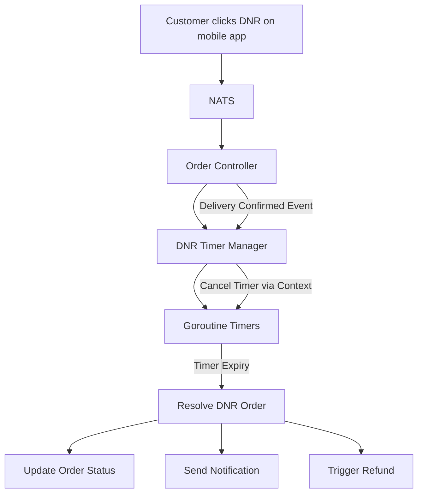
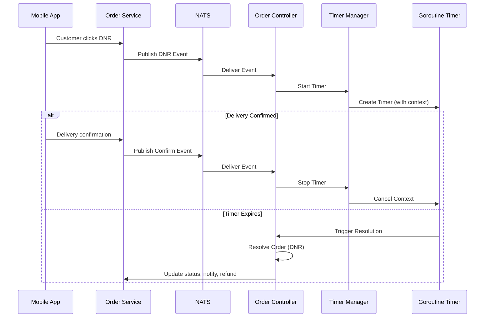
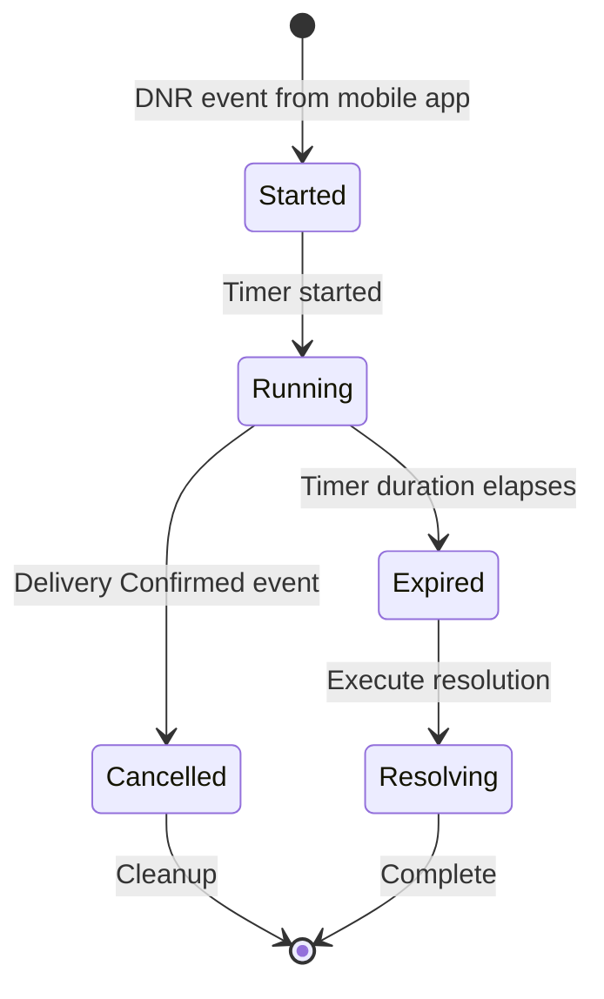
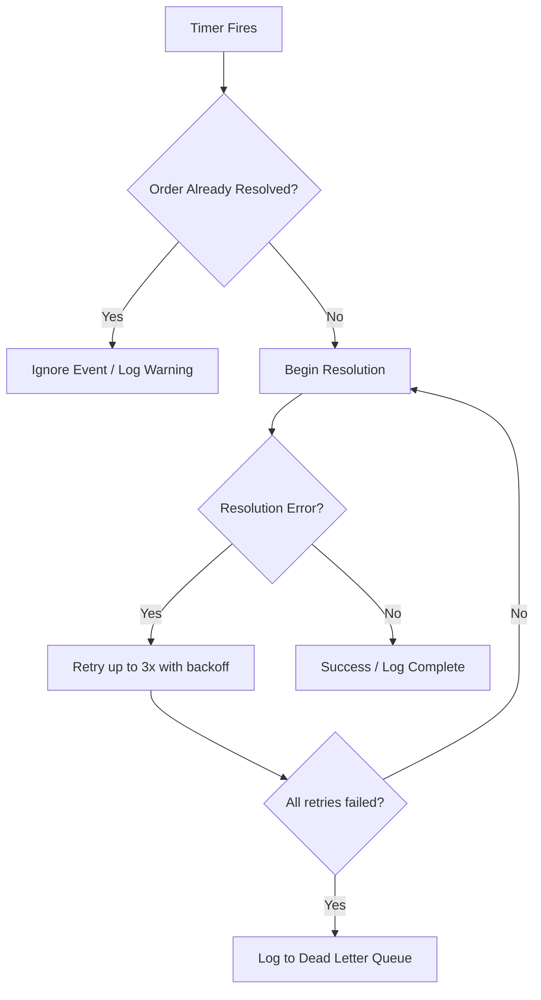
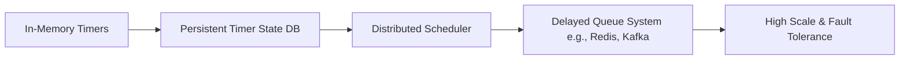

# 🧩 Event-Driven DNR Timer System

> An event-driven system for handling delayed "Delivery Not Received" resolution using Go, NATS, and concurrency patterns.

---

## 📌 Overview

The DNR Timer System listens to order events from a mobile app and triggers time-based resolution when a customer explicitly reports "Delivery Not Received." Each order gets a dedicated in-memory timer, safely managed with mutexes and cancellable via delivery confirmation events.

---

## 🧠 Problem Statement

When a customer marks an order as "Delivery Not Received" in the mobile app, the system must wait a configurable window before automatically resolving the order (e.g., refund, notification). If the customer later confirms delivery within that window, the pending resolution must be cancelled. This must work reliably under concurrent events.

---

## ⚙️ Key Features

- ⏱️ Per-order asynchronous timers using goroutines + `context.WithCancel`
- 🔁 Event-driven architecture using NATS (mobile app → order service → NATS → this system)
- 🛑 Safe timer cancellation on delivery confirmation
- 📦 Automated resolution of DNR orders after timeout
- 🔐 Thread-safe timer management using `sync.Mutex` (locked on every context create/remove)
- 📊 Lightweight observability: a single `time.Ticker` logs remaining time exactly 4 times per timer lifetime
- 📝 Structured logging for start, stop, expiry, and quarterly progress

---

## 🏗️ Architecture



---

## 🔁 Event Flow

### Timer Start Trigger
- Customer explicitly clicks "Delivery Not Received" in mobile app
- Order service publishes NATS event
- System receives event and starts per-order timer

### Timer Stop Trigger
- Customer (or delivery person) confirms delivery
- Delivery confirmation event published to NATS
- System cancels timer before expiry

### Timer Expiry
- No confirmation received within configured window
- Order automatically resolved as DNR
- Downstream actions: status update, notification, refund



---

## ⏱️ Timer Design

Each order gets a dedicated timer managed by a central `TimerManager`.

| Component | Implementation |
|-----------|----------------|
| Timer creation | `context.WithCancel` + goroutine + `time.NewTimer` |
| Timer cancellation | `cancel()` function called via mutex-protected map lookup |
| Concurrency control | `sync.Mutex` locked on every create/delete operation |
| Timer duration | Configurable per order type (e.g., 30 min food, 24h packages) |
| Observability | `time.Ticker` logs remaining time exactly 4 times per timer (quarterly progress) |



---

## 🧠 Design Considerations

### Concurrency
- Each timer runs in its own goroutine (non-blocking)
- `sync.Mutex` guards all timer create/delete operations on the shared map
- Context cancellation ensures goroutines don't leak

### Idempotency
- Timer manager checks for existing timer before creating a new one
- Duplicate DNR events for the same order are ignored
- Expiry events check order status before resolving

### Race Conditions
- Mutex lock on every context create/remove prevents concurrent start/stop races
- If expiry and confirmation arrive simultaneously, mutex ensures deterministic outcome (one wins, other is safely ignored)

### Observability
- Start/stop/expiry logged for every timer
- Remaining time logged exactly 4 times per timer via a dedicated ticker (quarterly)
- Active timer count observable via log aggregation

---

## ⚠️ Failure Handling



---

## ⚠️ Current Limitations

- Timers are stored **in-memory only** (lost on service restart)
- No persistence of pending timer state
- Requires downstream reconciliation or startup recovery for restarts
- Single-instance only (not horizontally scaled yet)

---

## 🚀 Scaling Evolution



---

## 🚀 Future Improvements

- Persist timer state in Redis/PostgreSQL for recovery on restart
- Implement exponential backoff retry for failed resolutions
- Dead-letter queue for failed events (manual review)
- Migrate to a distributed delay queue (e.g., Redis Sorted Sets, Kafka with timestamps)
- Add Prometheus metrics: active timers, expiry/cancel ratio, resolution latency
- Horizontal scaling with leader election or partition keys

---

## 🛠️ Tech Stack

| Technology | Purpose |
|------------|---------|
| Go (Golang) | Core implementation |
| NATS | Event streaming / message bus |
| Goroutines + Channels | Concurrency per timer |
| Context API | Cancellation control |
| sync.Mutex | Thread-safe timer map |
| time.Timer + time.Ticker | Timer execution + quarterly logging |

---

## 📊 Example Log Output

```
2025-01-15T10:00:00Z INFO timer started order_id=order_123 duration=30m
2025-01-15T10:07:30Z DEBUG timer remaining order_id=order_123 remaining=22m30s (1/4)
2025-01-15T10:15:00Z DEBUG timer remaining order_id=order_123 remaining=15m0s (2/4)
2025-01-15T10:22:30Z DEBUG timer remaining order_id=order_123 remaining=7m30s (3/4)
2025-01-15T10:29:00Z DEBUG timer remaining order_id=order_123 remaining=1m0s (4/4)
2025-01-15T10:30:00Z INFO timer expired order_id=order_123 action=resolving_dnr
2025-01-15T10:30:01Z INFO order resolved order_id=order_123 status=DNR refund_triggered=true
```

---

## 🎯 Key Takeaways

This system demonstrates:

- Event-driven architecture with NATS
- Asynchronous workflow management per entity
- Safe concurrency patterns in Go (mutex + context)
- Real-world reliability (idempotency, retries, race handling)
- Production-grade observability without overhead (quarterly logging)
- Honest limitation acknowledgment and scaling roadmap

---

## 👨‍💻 Author

**Qiniso Cele**  
Full-Stack Engineer | Backend & Systems Focus  
[GitHub](https://github.com/QinisoCele) • [LinkedIn](https://linkedin.com/in/qiniso-2209)

---

## 📄 Status

**Proof of Concept** — Designed for portfolio/demonstration purposes only.
